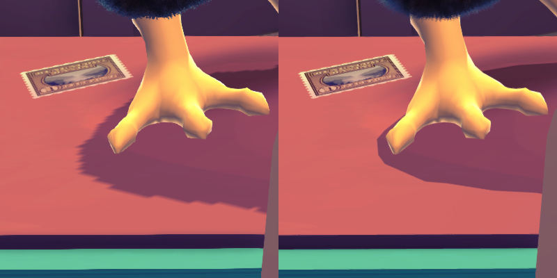
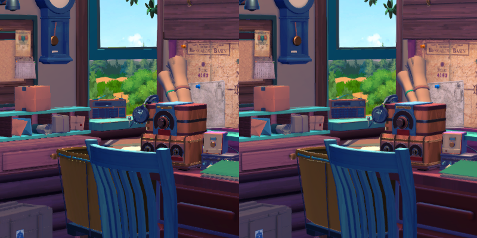

# Unity Quality, Shadow Resolution and Supersampling Mod

This is a very simple mod which allows you to change the basic quality settings and shadow resolution in Unity games,
and also do basic supersampling. It is useful when games have little to no graphics settings.

This **only works for games using the standard rendering pipeline** in Unity. It is also only really tested for a
single game at this point, [KeyWe](https://store.steampowered.com/app/1242980/KeyWe), but I do hope/expect it to work
for at least a few other Unity games with around the same engine version.

I spent a total of 4 hours or so on this, and that was mostly because I had never modded a Unity game before, so don't
expect too much. I just wanted better shadows in KeyWe, and then though "hey, how hard could it be to also do
supersampling?".

## What it does

Here's a before/after comparison of shadow modding from KeyWe:


And here's a before/after comparison of supersampling:


[Complete Original Screenshot](docs/KeyWe_1_unmodded.png)
vs
[Complete Modded Screenshot](docs/KeyWe_2_modded.png)

## Known Issues

 * Supersampling will break if you change the resolution in-game. Select your resolution in the game first and then use
   the mod. 

## Installation & Usage

This mod is based on BepInEx, so you need to install that first. Specifically, it was built and tested using 
[BepInEx 5.4.23.2](https://github.com/BepInEx/BepInEx/releases/tag/v5.4.23.2).

When you have installed BepInEx, just copy `at.ph3.unity.shadow.res.dll` to
`[gamedir]/BepInEx/plugins/at.ph3.unity.shadow.res/`.

On first launch, the configuration file `at.ph3.unity.shadow.res.cfg` will be created in the `BepInEx/config` directory.
You can use it for further configuration, for example, to force all shadow maps to a resolution of 4096 pixels:
```ini
## Settings file was created by plugin Shadow Resolution Mod v0.1.0
## Plugin GUID: at.ph3.unity.shadow.res

[General]

## override basic quality settings to the maximum
# Setting type: Boolean
# Default value: true
overrideQualitySettings = true

## fixed shadow resolution, 0 = unchanged
# Setting type: Int32
# Default value: 0
shadowResolution = 4096

## [EXPERIMENTAL] main camera sampling factor 
## (in percent of side length, 100 = unchanged, 200 = 4x pixels, ...)
# Setting type: Int32
# Default value: 100
samplingFactor = 100

## enable rendertarget dumping (press Ctrl+T, only works with samplingFactor != 100)
# Setting type: Boolean
# Default value: false
enableRenderTargetDumping = false
```
